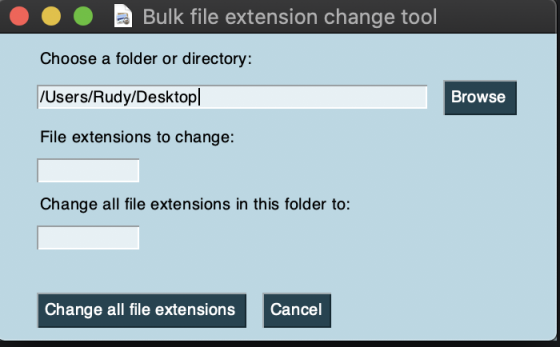
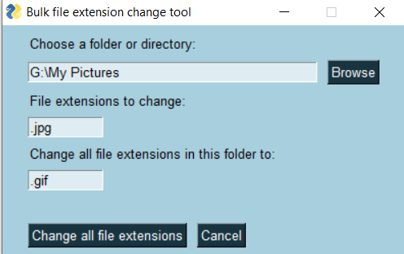

# 💪 [Bulk] 💪 File extension rename utility 

##### Description: Changes all specified file extensions in a directory. 

### ❓ What this is?

This is a simple, cross platform, single-app utility. 

Choose your platform:
- Windows: Download and double click the .exe file.
- MacOS: Download and unzip the .app file, double click the app to run.

### ❓ What does it do?

It renames all file extensions from one extension to another within a given directory. For example, you could change every `.jpg` file in `"C:\Users\YourName\Pictures"` to a `.png` file with one click.

### ❓ How do I use it?

Simply write, paste, or browse for a folder or directory.  

### 💻 MacOS Screenshot

### 🖥 Windows Screenshot

### 📽 MacOS Video
In this video, I change all of the `.png` files on my MacOS desktop to `.jpg` files. You can see the program doesn't affect any file extensions not specified by the program.

### 🎥 Windows Video
In this video, I change all .txt files in a directory to .md files on Windows.

### ❓ Questions? Bugs? 🐛

- [Get in touch with me](https://rudyfaile.com/contact/)